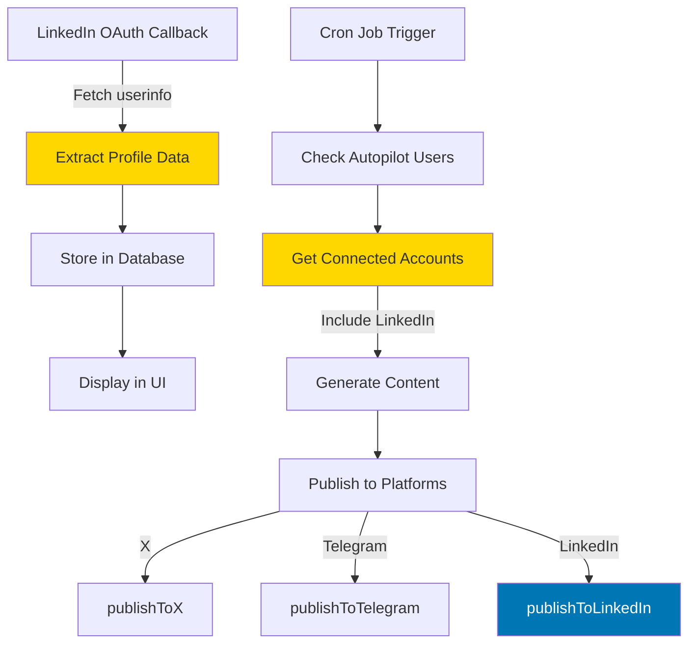

# LinkedIn Integration Fix Plan

## Problem Statement

The LinkedIn connection shows as "connected" but has the following issues:
1. **No profile information displayed** - Account shows "Personal Profile" instead of actual name/email
2. **Not included in cron job** - Auto-generation workflow only posts to X and Telegram, skipping LinkedIn
3. **Missing user data** - LinkedIn userinfo data (name, email, picture) is not being fetched or stored

## Root Cause Analysis

### Issue 1: Profile Data Not Fetched
**Location**: [`app/api/accounts/linkedin/callback/route.ts`](app/api/accounts/linkedin/callback/route.ts:190-202)

The callback currently:
- ✅ Fetches `/v2/userinfo` endpoint successfully
- ✅ Extracts `sub` (person ID) for posting
- ❌ **Does NOT extract or store** `name`, `email`, `picture` fields
- ❌ Hardcodes username as "Personal Profile"

```typescript
// Current code (line 241)
username: 'Personal Profile',  // ❌ Hardcoded, should use actual name
```

The userinfo response contains:
```json
{
  "sub": "abc123",           // ✓ Currently used
  "name": "John Doe",        // ✗ Not stored
  "email": "john@example.com", // ✗ Not stored  
  "picture": "https://...",  // ✗ Not stored
  "email_verified": true
}
```

### Issue 2: LinkedIn Excluded from Cron Job
**Location**: [`app/api/cron/publish/route.ts`](app/api/cron/publish/route.ts:201-216)

The auto-generation workflow explicitly filters OUT LinkedIn:

```typescript
// Line 206 - Only fetches X and Telegram
.in('platform', ['x', 'telegram'])  // ❌ LinkedIn excluded
```

This means even with autopilot enabled, LinkedIn accounts are never used for posting.

### Issue 3: Database Schema Limitation
**Location**: [`types/database.ts`](types/database.ts:60-109)

The `connected_accounts` table has:
- ✅ `username` field (string) - currently stores "Personal Profile"
- ❌ No dedicated field for full name
- ❌ No field for email
- ❌ No field for profile picture URL
- ❌ No metadata JSON field for additional profile data

## Solution Architecture



## Implementation Plan

### Phase 1: Fix Profile Data Collection

#### Step 1.1: Update LinkedIn Callback to Extract Profile Data
**File**: [`app/api/accounts/linkedin/callback/route.ts`](app/api/accounts/linkedin/callback/route.ts)

Extract additional fields from userinfo response:
```typescript
const userinfoData = await userinfoResponse.json()

const personId = userinfoData.sub
const fullName = userinfoData.name || 'LinkedIn User'
const email = userinfoData.email || null
const profilePicture = userinfoData.picture || null
```

#### Step 1.2: Store Profile Data in Database
Update the database insert to use actual profile data:
```typescript
.upsert({
  user_id: user.id,
  platform: 'linkedin',
  platform_user_id: personId,
  access_token: encryptedToken,
  token_expires_at: expiresAt,
  username: fullName,  // ✓ Use actual name instead of "Personal Profile"
  is_active: true,
}, {
  onConflict: 'user_id,platform',
})
```

#### Step 1.3: Add Metadata Storage (Optional Enhancement)
Store additional profile data in `generation_metadata` or create a new JSON field:
```typescript
profile_metadata: {
  email: email,
  picture: profilePicture,
  email_verified: userinfoData.email_verified
}
```

### Phase 2: Integrate LinkedIn into Cron Job

#### Step 2.1: Update Account Query Filter
**File**: [`app/api/cron/publish/route.ts`](app/api/cron/publish/route.ts:201-216)

Change the platform filter to include LinkedIn:
```typescript
// Before (line 206)
.in('platform', ['x', 'telegram'])

// After
.in('platform', ['x', 'telegram', 'linkedin'])
```

#### Step 2.2: Add LinkedIn Publishing Logic
**File**: [`app/api/cron/publish/route.ts`](app/api/cron/publish/route.ts:336-434)

Update the publishing loop to handle LinkedIn:
```typescript
// Add import at top
import { publishToLinkedIn } from '@/lib/platforms/linkedin'

// In the publishing loop (around line 360)
let publishResult

if (platform === 'x') {
  publishResult = await publishToX(publishArgs)
} else if (platform === 'telegram') {
  publishResult = await publishToTelegram({
    ...publishArgs,
    platformUserId: account.platform_user_id,
  })
} else if (platform === 'linkedin') {
  // ✓ Add LinkedIn support
  publishResult = await publishToLinkedIn(publishArgs)
} else {
  continue // Skip unsupported platforms
}
```

#### Step 2.3: Create Platform Variant for LinkedIn
**File**: [`lib/platforms/transformers.ts`](lib/platforms/transformers.ts)

Verify that `createPlatformVariants` includes LinkedIn formatting:
```typescript
export function createPlatformVariants(masterContent: string) {
  return {
    x: formatForX(masterContent),
    telegram: formatForTelegram(masterContent),
    linkedin: formatForLinkedIn(masterContent), // ✓ Ensure this exists
  }
}
```

### Phase 3: UI Improvements

#### Step 3.1: Update Accounts Display
**File**: [`app/(dashboard)/accounts/page.tsx`](app/(dashboard)/accounts/page.tsx:244-268)

The UI already displays `account.username`, so once we store the actual name, it will automatically show correctly.

Optional enhancement - show profile picture:
```typescript
{account.platform === 'linkedin' && account.profile_metadata?.picture && (
  
)}
```

### Phase 4: Testing & Validation

#### Step 4.1: Test OAuth Flow
1. Disconnect existing LinkedIn account
2. Reconnect LinkedIn account
3. Verify database stores actual name from userinfo
4. Verify UI displays correct name

#### Step 4.2: Test Cron Job Publishing
1. Enable autopilot
2. Set schedule time
3. Wait for cron trigger OR manually trigger `/api/cron/publish`
4. Verify LinkedIn account is included in publishing
5. Check LinkedIn profile for posted content

#### Step 4.3: Verify Error Handling
1. Test with expired LinkedIn token
2. Test with invalid OAuth scopes
3. Verify error messages are clear and actionable

## Technical Details

### LinkedIn API Endpoints Used

1. **OAuth Token Exchange**
   - Endpoint: `POST https://www.linkedin.com/oauth/v2/accessToken`
   - Returns: `access_token`, `expires_in`, `scope`

2. **User Profile (OIDC)**
   - Endpoint: `GET https://api.linkedin.com/v2/userinfo`
   - Headers: `Authorization: Bearer {token}`
   - Returns: `sub`, `name`, `email`, `picture`, `email_verified`
   - Required scope: `openid`, `profile`, `email`

3. **Post Publishing (UGC)**
   - Endpoint: `POST https://api.linkedin.com/v2/ugcPosts`
   - Headers: `Authorization: Bearer {token}`, `LinkedIn-Version: 202401`
   - Required scope: `w_member_social`

### Database Schema Considerations

**Current Schema** (no changes needed):
```typescript
connected_accounts {
  username: string  // Will store full name instead of "Personal Profile"
  platform_user_id: string  // Stores LinkedIn person ID (sub)
  access_token: string  // Encrypted OAuth token
  token_expires_at: string | null  // Token expiration
}
```

**Optional Enhancement** (if we want to store more data):
Add a `profile_metadata` JSON column to store:
- Email address
- Profile picture URL
- Email verification status
- LinkedIn profile URL

### Content Formatting for LinkedIn

LinkedIn has different characteristics than X/Telegram:
- **Character limit**: 3000 (vs 280 for X)
- **Audience**: Professional network
- **Tone**: More formal, business-oriented
- **Hashtags**: Less common, more strategic
- **Links**: Full URLs work well (no URL shortening needed)

The transformer should:
```typescript
function formatForLinkedIn(content: string): string {
  // LinkedIn allows longer content
  if (content.length > 3000) {
    return content.substring(0, 2997) + '...'
  }
  
  // Keep professional tone
  // Add line breaks for readability
  // Include relevant hashtags at end
  
  return content
}
```

## Files to Modify

### Critical Changes (Required)
1. ✅ [`app/api/accounts/linkedin/callback/route.ts`](app/api/accounts/linkedin/callback/route.ts:190-241)
   - Extract name, email, picture from userinfo
   - Store actual name instead of "Personal Profile"

2. ✅ [`app/api/cron/publish/route.ts`](app/api/cron/publish/route.ts:201-434)
   - Add 'linkedin' to platform filter
   - Add LinkedIn publishing logic in the loop

### Supporting Changes (Recommended)
3. ✅ [`lib/platforms/transformers.ts`](lib/platforms/transformers.ts)
   - Verify/add LinkedIn content formatter

4. ⚠️ [`lib/platforms/linkedin.ts`](lib/platforms/linkedin.ts:48-151)
   - Already has `publishToLinkedIn` function
   - Verify it works correctly with current token format

### Optional Enhancements
5. 📋 [`types/database.ts`](types/database.ts:60-109)
   - Add `profile_metadata` JSON field (optional)

6. 📋 [`app/(dashboard)/accounts/page.tsx`](app/(dashboard)/accounts/page.tsx:244-268)
   - Add profile picture display (optional)

## Risk Assessment

### Low Risk ✅
- Extracting additional fields from userinfo (already being fetched)
- Storing name in existing `username` field
- Adding LinkedIn to platform filter

### Medium Risk ⚠️
- LinkedIn posting in cron job (needs testing)
- Token expiration handling
- Content formatting for LinkedIn audience

### High Risk ❌
- None identified (all changes are additive, not breaking)

## Rollback Plan

If issues occur:
1. **Profile data issues**: Revert callback changes, reconnect account
2. **Cron job issues**: Remove 'linkedin' from platform filter
3. **Publishing errors**: LinkedIn posts will fail gracefully, other platforms unaffected

## Success Criteria

✅ LinkedIn account displays actual user name (not "Personal Profile")
✅ Cron job includes LinkedIn in auto-generation workflow
✅ Posts successfully publish to LinkedIn when autopilot triggers
✅ Error handling works for expired tokens
✅ UI shows correct account information

## Timeline Estimate

- **Phase 1** (Profile Data): 30-45 minutes
- **Phase 2** (Cron Integration): 45-60 minutes  
- **Phase 3** (UI Updates): 15-30 minutes
- **Phase 4** (Testing): 30-45 minutes

**Total**: 2-3 hours for complete implementation and testing

## Next Steps

1. Review this plan with stakeholders
2. Confirm LinkedIn OAuth scopes are correctly configured
3. Begin implementation with Phase 1 (lowest risk)
4. Test each phase before proceeding to next
5. Deploy and monitor for issues

---

**Note**: The LinkedIn posting functionality ([`lib/platforms/linkedin.ts`](lib/platforms/linkedin.ts)) already exists and is working. The main issues are:
1. Not fetching/storing profile data properly
2. Not including LinkedIn in the cron job workflow

Both are straightforward fixes with minimal risk.
