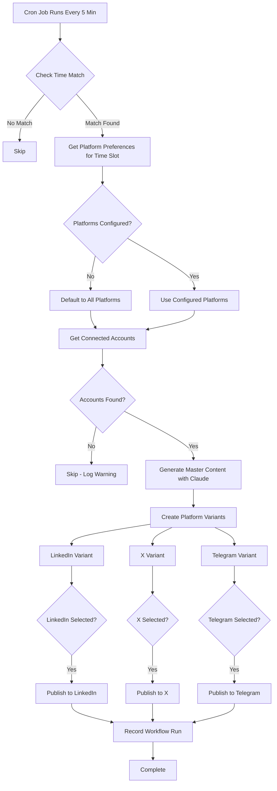

# Per-Time-Slot Platform Selection - Implementation Plan

## Executive Summary

This plan redesigns the scheduling system to allow users to select which platforms (LinkedIn, X, Telegram) to post to for each specific time slot, replacing the current "all platforms at all times" approach.

## Current System Analysis

### Architecture Overview

**Current Behavior:**
- Posts to ALL connected platforms (X, Telegram) at each scheduled time
- LinkedIn exists but is excluded from auto-generation workflow
- Image generation can be enabled per-time-slot
- Schedule stored in `schedule_config` table with global settings

**Key Components:**
1. **Schedule Configuration** ([`schedule_config`](types/database.ts:353-399))
   - Stores: `days_of_week`, `times`, `frequency`, `timezone`
   - Image settings: `image_generation_enabled`, `image_times[]`
   - One row per user (user_id is unique)

2. **Workflow Execution** ([`app/api/cron/publish/route.ts`](app/api/cron/publish/route.ts:126-478))
   - Runs every 5 minutes via Supabase cron
   - Checks time match with [`checkTimeMatch()`](lib/autopilot/workflow-helpers.ts:37-99)
   - Generates content once with Claude
   - Creates platform variants with [`createPlatformVariants()`](lib/platforms/transformers.ts:16-21)
   - Publishes to X and Telegram (hardcoded in line 207)

3. **Content Generation** ([`lib/ai/generator.ts`](lib/ai/generator.ts:25-110))
   - Single master content generated by Claude
   - Platform variants created deterministically
   - Currently only X and Telegram variants exist

4. **Platform Publishers**
   - X: [`publishToX()`](lib/pipeline/publisher.ts:109)
   - Telegram: [`publishToTelegram()`](lib/pipeline/publisher.ts:101-104)
   - LinkedIn: [`publishToLinkedIn()`](lib/platforms/linkedin.ts:48-151) - exists but unused in autopilot

### Current Limitations

1. **No Platform Selection**: All connected accounts post at every scheduled time
2. **LinkedIn Excluded**: LinkedIn platform exists but not in auto-generation workflow
3. **No Granular Control**: Can't say "LinkedIn at 9 AM, X at 3 PM"
4. **Hardcoded Platform List**: Line 207 in cron route hardcodes `['x', 'telegram']`

---

## Solution Design

### 1. Database Schema Changes

#### Option A: Add JSONB Column to `schedule_config` (RECOMMENDED)

Add a `platform_preferences` JSONB column to store per-slot platform selections:

```sql
-- Migration: add_platform_preferences_to_schedule_config.sql

ALTER TABLE schedule_config 
ADD COLUMN platform_preferences JSONB DEFAULT '{}';

-- Example data structure:
-- {
--   "09:00": ["linkedin", "x"],
--   "15:00": ["x", "telegram"],
--   "18:00": ["linkedin", "telegram"]
-- }

-- Add index for performance
CREATE INDEX idx_schedule_config_platform_preferences 
ON schedule_config USING GIN (platform_preferences);

-- Add comment
COMMENT ON COLUMN schedule_config.platform_preferences IS 
'Per-time-slot platform selection. Key: time (HH:MM), Value: array of platforms [linkedin, x, telegram]';
```

**Advantages:**
- Simple schema change (one column)
- Flexible structure
- Easy to query and update
- Maintains existing schedule_config structure
- No additional joins needed

**Data Structure:**
```typescript
type PlatformPreferences = {
  [timeSlot: string]: Platform[] // e.g., "09:00": ["linkedin", "x"]
}
```

**RECOMMENDATION: Use Option A (JSONB column)** - simpler, more maintainable, and sufficient for this feature.

#### TypeScript Type Updates

Update [`types/database.ts`](types/database.ts:353-399):

```typescript
schedule_config: {
  Row: {
    id: string
    user_id: string
    days_of_week: string[] | null
    times: string[] | null
    frequency: 'daily' | 'weekly' | 'monthly' | null
    timezone: string | null
    image_generation_enabled: boolean | null
    image_times: string[] | null
    platform_preferences: Json | null  // NEW: { "09:00": ["linkedin", "x"], ... }
    created_at: string
    updated_at: string
  }
  Insert: {
    // ... same with platform_preferences?: Json | null
  }
  Update: {
    // ... same with platform_preferences?: Json | null
  }
}
```

Add helper type in [`lib/autopilot/workflow-helpers.ts`](lib/autopilot/workflow-helpers.ts:14-21):

```typescript
export type PlatformPreferences = {
  [timeSlot: string]: Platform[]
}

export type ScheduleConfig = {
  days_of_week: string[] | null
  times: string[] | null
  timezone: string | null
  image_generation_enabled?: boolean | null
  image_times?: string[] | null
  platform_preferences?: PlatformPreferences | null  // NEW
}
```

---

### 2. UI/UX Design - Schedule Page

#### Current UI Structure

[`app/(dashboard)/schedule/page.tsx`](app/(dashboard)/schedule/page.tsx:15-377) has:
- Frequency selector (daily/weekly/monthly)
- Days of week selector
- Times list with add/remove
- Image generation toggle with per-time selection

#### New UI Component: Platform Selector Per Time Slot

Add platform checkboxes for each time slot, similar to image generation UI. Insert after the "Posting Times" section (after line 257).

#### Visual Design

```
┌─────────────────────────────────────────────────────────┐
│ 🎯 Platform Selection                                   │
│    Choose which platforms to post to at each time       │
├─────────────────────────────────────────────────────────┤
│                                                          │
│ ┌─────────────────────────────────────────────────────┐ │
│ │ 09:00                              [Select all]     │ │
│ ├─────────────────────────────────────────────────────┤ │
│ │ ┌──────────┐  ┌──────────┐  ┌──────────┐          │ │
│ │ │☑ 💼      │  │☑ 𝕏       │  │☐ ✈️      │          │ │
│ │ │ LinkedIn │  │ X        │  │ Telegram │          │ │
│ │ └──────────┘  └──────────┘  └──────────┘          │ │
│ └─────────────────────────────────────────────────────┘ │
│                                                          │
│ ┌─────────────────────────────────────────────────────┐ │
│ │ 15:00                              [Deselect all]   │ │
│ ├─────────────────────────────────────────────────────┤ │
│ │ ┌──────────┐  ┌──────────┐  ┌──────────┐          │ │
│ │ │☑ 💼      │  │☑ 𝕏       │  │☑ ✈️      │          │ │
│ │ │ LinkedIn │  │ X        │  │ Telegram │          │ │
│ │ └──────────┘  └──────────┘  └──────────┘          │ │
│ └─────────────────────────────────────────────────────┘ │
│                                                          │
│ 💡 Platform Selection Tips                              │
│ • LinkedIn works best for professional content...       │
│ • X (Twitter) is great for quick updates...            │
└─────────────────────────────────────────────────────────┘
```

#### Default Behavior

When user adds a new time slot:
- **Default to all platforms selected** (LinkedIn, X, Telegram)
- User can then deselect platforms they don't want
- This ensures backward compatibility (existing users get all platforms by default)

---

### 3. API Route Updates

Update [`app/api/schedule/route.ts`](app/api/schedule/route.ts:28-66) to:
- Accept `platform_preferences` in POST body
- Validate structure (object with array values)
- Validate platform names (linkedin, x, telegram)
- Save to database

---

### 4. Workflow Logic Updates

#### Add Helper Function

Create [`getPlatformsForTime()`](lib/autopilot/workflow-helpers.ts) helper:

```typescript
/**
 * Get platforms to post to for a specific time slot
 * 
 * @param schedule - User's schedule configuration
 * @param matchedTime - The matched time from checkTimeMatch (e.g., "09:00")
 * @returns Array of platforms to post to, or all platforms if not configured
 */
export function getPlatformsForTime(
  schedule: ScheduleConfig,
  matchedTime?: string
): Platform[] {
  // If no matched time, return empty array
  if (!matchedTime) {
    return []
  }

  // If platform_preferences not configured, default to all platforms
  if (!schedule.platform_preferences) {
    return ['linkedin', 'x', 'telegram']
  }

  // Get platforms for this specific time slot
  const platforms = schedule.platform_preferences[matchedTime]

  // If time slot not configured, default to all platforms
  if (!platforms || platforms.length === 0) {
    return ['linkedin', 'x', 'telegram']
  }

  return platforms
}
```

#### Update Cron Workflow

In [`app/api/cron/publish/route.ts`](app/api/cron/publish/route.ts:202-216):

**BEFORE:**
```typescript
.in('platform', ['x', 'telegram'])  // ❌ HARDCODED
```

**AFTER:**
```typescript
// Get platforms to post to for this time slot
const platformsToPost = getPlatformsForTime(schedule, matchResult.matchedTime)

if (platformsToPost.length === 0) {
  console.log('[Auto-Gen] No platforms configured for this time slot')
  results.push({ userId: user.id, status: 'skipped', error: 'No platforms configured' })
  continue
}

console.log(`[Auto-Gen] Platforms for ${matchResult.matchedTime}:`, platformsToPost)

const { data: accountsData } = await supabase
  .from('connected_accounts')
  .select('id, platform, access_token, platform_user_id, username, token_expires_at')
  .eq('user_id', user.id)
  .eq('is_active', true)
  .in('platform', platformsToPost)  // ✅ DYNAMIC
```

---

### 5. Content Generation Updates for LinkedIn

#### Update Platform Variants

In [`lib/platforms/transformers.ts`](lib/platforms/transformers.ts:8-21):

```typescript
export interface PlatformVariants {
  x: string
  telegram: string
  linkedin: string  // NEW
}

export function createPlatformVariants(masterContent: string): PlatformVariants {
  return {
    x: optimizeForX(masterContent),
    telegram: optimizeForTelegram(masterContent),
    linkedin: optimizeForLinkedIn(masterContent),  // NEW - function already exists
  }
}
```

#### Update Content Generation Prompt

In [`lib/ai/generator.ts`](lib/ai/generator.ts:147-171), add multi-platform guidance:

```typescript
// NEW: Multi-platform guidance
prompt += `\n\nThis content will be adapted for multiple platforms (X/Twitter, LinkedIn, Telegram).`
prompt += `\nCreate engaging, professional content that works well across platforms.`
prompt += `\nFor LinkedIn: Professional tone, industry insights, thought leadership.`
prompt += `\nFor X: Concise, punchy, engaging (will be truncated to 280 chars).`
prompt += `\nFor Telegram: Can be longer, conversational, community-focused.`
```

#### Update Platform Variant Selection

In [`app/api/cron/publish/route.ts`](app/api/cron/publish/route.ts:336-339):

**BEFORE:**
```typescript
const content = platform === 'x' ? variants.x : variants.telegram
```

**AFTER:**
```typescript
let content: string
switch (platform) {
  case 'x':
    content = variants.x
    break
  case 'telegram':
    content = variants.telegram
    break
  case 'linkedin':
    content = variants.linkedin
    break
  default:
    console.warn(`[Auto-Gen] Unknown platform: ${platform}`)
    continue
}
```

#### Update Generator to Include LinkedIn

In [`lib/pipeline/generator.ts`](lib/pipeline/generator.ts:99-116):

**BEFORE:**
```typescript
.in('platform', ['x', 'telegram'])  // ❌ HARDCODED
```

**AFTER:**
```typescript
.in('platform', ['x', 'telegram', 'linkedin'])  // ✅ INCLUDE LINKEDIN
```

Also update the content selection logic (line 122-124) to use switch statement like above.

---

### 6. Migration Strategy

#### Phase 1: Database Migration

```sql
-- File: supabase/migrations/YYYYMMDD_add_platform_preferences.sql

-- Add platform_preferences column
ALTER TABLE schedule_config 
ADD COLUMN platform_preferences JSONB DEFAULT '{}';

-- Add index for performance
CREATE INDEX idx_schedule_config_platform_preferences 
ON schedule_config USING GIN (platform_preferences);

-- Add comment
COMMENT ON COLUMN schedule_config.platform_preferences IS 
'Per-time-slot platform selection. Key: time (HH:MM), Value: array of platforms [linkedin, x, telegram]';

-- Migrate existing users to default behavior (all platforms for all times)
-- This ensures backward compatibility
UPDATE schedule_config
SET platform_preferences = (
  SELECT jsonb_object_agg(
    time_slot,
    '["linkedin", "x", "telegram"]'::jsonb
  )
  FROM unnest(times) AS time_slot
)
WHERE times IS NOT NULL 
  AND array_length(times, 1) > 0
  AND (platform_preferences IS NULL OR platform_preferences = '{}'::jsonb);
```

#### Phase 2: Code Deployment

Deploy in this order:
1. Database migration (add column)
2. Backend updates (API routes, workflow helpers)
3. Frontend updates (UI components)

#### Phase 3: User Communication

Update the info box in schedule page to explain the new feature.

---

## Implementation Checklist

### Database Layer
- [ ] Create migration file: `add_platform_preferences_to_schedule_config.sql`
- [ ] Add `platform_preferences` JSONB column to `schedule_config` table
- [ ] Add GIN index on `platform_preferences` column
- [ ] Run migration to add default values for existing users
- [ ] Update [`types/database.ts`](types/database.ts) with new column type

### Backend - Type Definitions
- [ ] Add `PlatformPreferences` type to [`lib/autopilot/workflow-helpers.ts`](lib/autopilot/workflow-helpers.ts)
- [ ] Update `ScheduleConfig` type to include `platform_preferences`
- [ ] Import `Platform` type from [`lib/types/platform.ts`](lib/types/platform.ts)

### Backend - Helper Functions
- [ ] Create `getPlatformsForTime()` function in [`lib/autopilot/workflow-helpers.ts`](lib/autopilot/workflow-helpers.ts)
- [ ] Add unit tests for `getPlatformsForTime()` with various scenarios
- [ ] Test default behavior (returns all platforms when not configured)

### Backend - API Routes
- [ ] Update [`app/api/schedule/route.ts`](app/api/schedule/route.ts) POST handler
- [ ] Add `platform_preferences` to request body parsing
- [ ] Add validation for `platform_preferences` structure
- [ ] Add validation for platform names (linkedin, x, telegram)
- [ ] Update database upsert to include `platform_preferences`
- [ ] Update GET handler to return `platform_preferences`

### Backend - Workflow Logic
- [ ] Update [`app/api/cron/publish/route.ts`](app/api/cron/publish/route.ts) line 202-207
- [ ] Replace hardcoded `['x', 'telegram']` with `getPlatformsForTime()` call
- [ ] Add logging for selected platforms per time slot
- [ ] Add error handling for empty platform list
- [ ] Update line 336-339 to use switch statement for platform variant selection

### Backend - Content Generation
- [ ] Update [`lib/platforms/transformers.ts`](lib/platforms/transformers.ts) interface
- [ ] Add `linkedin: string` to `PlatformVariants` interface
- [ ] Add `linkedin: optimizeForLinkedIn(masterContent)` to `createPlatformVariants()`
- [ ] Update [`lib/ai/generator.ts`](lib/ai/generator.ts) prompt builder
- [ ] Add multi-platform guidance to prompt
- [ ] Update [`lib/pipeline/generator.ts`](lib/pipeline/generator.ts) line 99-105
- [ ] Change `['x', 'telegram']` to `['x', 'telegram', 'linkedin']`
- [ ] Update line 122-124 to use switch statement for content selection

### Frontend - Schedule Page UI
- [ ] Add `platformPreferences` state to [`app/(dashboard)/schedule/page.tsx`](app/(dashboard)/schedule/page.tsx)
- [ ] Add platform selection section after "Posting Times" (after line 257)
- [ ] Create platform checkbox grid (LinkedIn, X, Telegram)
- [ ] Add "Select all" / "Deselect all" toggle per time slot
- [ ] Add warning message when no platforms selected
- [ ] Add platform selection tips info box
- [ ] Implement `togglePlatformForTime()` function
- [ ] Implement `toggleAllPlatformsForTime()` function
- [ ] Update `fetchSchedule()` to load `platform_preferences`
- [ ] Update `handleSave()` to send `platform_preferences`
- [ ] Update `addTime()` to default new slots to all platforms
- [ ] Update `removeTime()` to clean up platform preferences

### Frontend - Styling
- [ ] Add platform-specific hover colors (indigo for LinkedIn, blue for X, sky for Telegram)
- [ ] Add platform icons/emojis (💼 LinkedIn, 𝕏 X, ✈️ Telegram)
- [ ] Ensure dark mode compatibility
- [ ] Add responsive grid layout for mobile
- [ ] Test accessibility (keyboard navigation, screen readers)

### Testing
- [ ] Test database migration on staging environment
- [ ] Test backward compatibility (existing users get all platforms)
- [ ] Test new user flow (defaults to all platforms)
- [ ] Test platform selection UI (check/uncheck, select all)
- [ ] Test API validation (invalid platform names, invalid structure)
- [ ] Test workflow with different platform combinations
- [ ] Test LinkedIn content generation and publishing
- [ ] Test edge cases (no platforms selected, all platforms selected)
- [ ] Test time slot add/remove with platform preferences
- [ ] Test cron job with new platform selection logic

### Documentation
- [ ] Update README with new platform selection feature
- [ ] Add screenshots of new UI to documentation
- [ ] Document `platform_preferences` data structure
- [ ] Document `getPlatformsForTime()` function
- [ ] Add migration notes for existing users
- [ ] Update API documentation for `/api/schedule` endpoint

### Deployment
- [ ] Run database migration on production
- [ ] Deploy backend changes
- [ ] Deploy frontend changes
- [ ] Monitor logs for errors
- [ ] Verify existing schedules still work
- [ ] Test new platform selection feature in production

---

## Risk Assessment

### High Risk
- **Breaking existing schedules**: Mitigated by migration script that sets all platforms for existing users
- **LinkedIn API failures**: Mitigated by existing error handling in [`publishToLinkedIn()`](lib/platforms/linkedin.ts:48-151)

### Medium Risk
- **UI complexity**: Mitigated by following existing image generation UI pattern
- **Performance**: Mitigated by GIN index on JSONB column

### Low Risk
- **Type safety**: TypeScript will catch most issues at compile time
- **Data validation**: API route validates structure and platform names

---

## Success Criteria

1. ✅ Users can select different platforms for different time slots
2. ✅ LinkedIn is included in auto-generation workflow
3. ✅ Existing schedules continue to work (backward compatibility)
4. ✅ UI is intuitive and follows existing design patterns
5. ✅ Content is optimized for each platform (X, Telegram, LinkedIn)
6. ✅ No performance degradation in cron job execution
7. ✅ All tests pass
8. ✅ Documentation is updated

---

## Timeline Estimate

- **Database Migration**: 1 hour
- **Backend Implementation**: 4-6 hours
- **Frontend Implementation**: 4-6 hours
- **Testing**: 2-3 hours
- **Documentation**: 1-2 hours
- **Deployment & Monitoring**: 1-2 hours

**Total**: 13-20 hours

---

## Future Enhancements

1. **Platform-Specific Topics**: Allow different topics per platform
2. **Platform-Specific Tone**: Allow different tone per platform
3. **Platform Analytics**: Show which platforms perform best at which times
4. **Smart Recommendations**: Suggest optimal platform combinations based on historical data
5. **Bulk Operations**: "Apply to all time slots" button for platform selection
6. **Templates**: Save and reuse platform selection patterns

---

## Mermaid Diagram: Workflow Flow



---

## Mermaid Diagram: Data Flow

```mermaid
graph LR
    A[User Configures Schedule] --> B[schedule_config Table]
    B --> C[platform_preferences JSONB]
    C --> D["{ '09:00': ['linkedin', 'x'], '15:00': ['telegram'] }"]
    D --> E[Cron Job Reads Config]
    E --> F[getPlatformsForTime Function]
    F --> G[Returns Platform Array]
    G --> H[Query Connected Accounts]
    H --> I[Filter by Selected Platforms]
    I --> J[Generate & Publish]
```



---

## Notes

- The [`optimizeForLinkedIn()`](lib/platforms/transformers.ts:88-104) function already exists, so no need to create it
- The [`publishToLinkedIn()`](lib/platforms/linkedin.ts:48-151) function is fully implemented and tested
- LinkedIn OAuth is configured for personal profiles only (company pages disabled)
- Image generation logic remains unchanged - it's orthogonal to platform selection
- The migration ensures zero downtime and backward compatibility

---

## Questions for Stakeholder

1. Should we allow users to post to zero platforms for a time slot? (Currently shows warning)
2. Should we add a "quick setup" wizard for common patterns (e.g., "Professional hours: LinkedIn only")?
3. Should we track which platform combinations perform best and suggest them?
4. Do we want to add platform-specific content customization in the future?

---

## Conclusion

This implementation plan provides a comprehensive approach to adding per-time-slot platform selection while maintaining backward compatibility and following existing code patterns. The feature integrates seamlessly with the current architecture and sets the foundation for future platform-specific enhancements.
